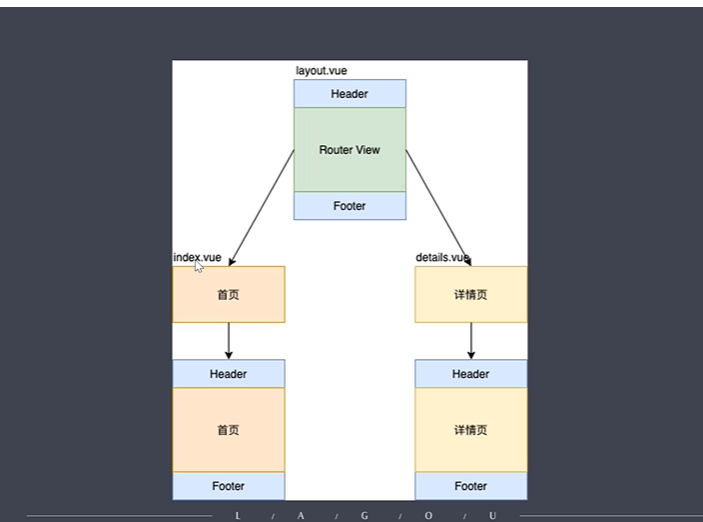

# 1. vue-router 的原理实现

## 1.1 Vue Router 基础使用

### 1.1.1 Vue Router 的使用步骤

前提是创建一些组件，好让路由规则的 path 映射 component

1. 注册路由插件

- vue.use 是用来注册插件，传递参数
- 如果参数是一个函数的话，Vue.use 内部直接调用这个函数来注册插件
- 如果参数是一个对象的话，他会调用传入对象的 install 方法来注册插件

2. 定义路由规则数组

- path 改变，会调用对应的 component

3. 创建 router 对象

   - 通过 vue-router 创建一个 router 对象，创建 router 对象的时候需要把路由规则数组传递过来，然后导出这个路由对象

4. 注册路由对象

   - 在创建 vue 实例的时候，注册一下 router 对象

5. 创建路由组件的占位

   - 路由规则 path 对应的 component 显示的地方

6. 创建链接
   - 路由规则中定义的 path

```js
// router/index.js 中注册路由插件，定义路由规则，创建路由对象并导出
import Vue from "vue";
import VueRouter from "vue-router";
import Home from "../views/Home.vue";
// 1. 注册路由插件
Vue.use(VueRouter);

// 2. 定义路由规则数组
// path改变了，会调用对应的component
const routes = [
  {
    path: "/",
    name: "Home",
    component: Home,
  },
  {
    path: "/about",
    name: "About",
    // route level code-splitting
    // this generates a separate chunk (about.[hash].js) for this route
    // which is lazy-loaded when the route is visited.
    component: () =>
      import(/* webpackChunkName: "about" */ "../views/About.vue"),
  },
];
// 3. 创建 router对象
const router = new VueRouter({
  mode: "history",
  base: process.env.BASE_URL,
  routes,
});
// 3.1 导出路由对象
export default router;

// main.js 中注册路由对象
import Vue from "vue";
import App from "./App.vue";
import router from "./router"; // 导入路由对象

Vue.config.productionTip = false;

new Vue({
  // 4. 注册路由对象
  router,
  render: (h) => h(App),
}).$mount("#app");

// app.vue 中使用路由
<template>
  <div id="app">
    <div id="nav">
      <!-- 6.创建链接:  路由规则中定义的path -->
      <router-link to="/">Home</router-link>|
      <router-link to="/about">About</router-link>
    </div>
    <!-- 5.创建路由组件的占位: 路由规则path对应的component显示的地方 -->
    <router-view />
  </div>
</template>
```

讨论一下： 创建 vue 实例的时候传入 router 对象的作用是什么

- 当我们创建 vue 实例的时候，我们配置上 router 对象这个选项，他会给 vue 实例分别注入$route和$router 这两个属性。
- \$route 存取的是我们当前路由的路由规则(属性)
  - name,path,hash,params,query,meta,matched,fullPath
- \$router 存取的是一些路由方法
  - push,replase,go,forward,back
  - mode 当前路由模式 hash/history
  - currentRoute 拿到\$route(当前路由的规则)

```js
// main.js 中注册路由对象
import Vue from "vue";
import App from "./App.vue";
// import router from "./router"; // 导入路由对象

Vue.config.productionTip = false;

const vm = new Vue({
  // 4. 注册路由对象
  // router,
  render: (h) => h(App),
}).$mount("#app");

console.log(vm);
```

### 1.1.2 动态路由

1. 动态路由通过一个占位来匹配我们变化的位置

```js
// router/index.js
const routes = [
  {
    path: "/",
    name: "Home",
    component: Home,
  },
  {
    path: "/detail/:id", // 动态路由通过一个占位来匹配我们变化的位置
    name: "Detail",
    props: true, // 会把url中的参数传递给相应的组件，而在组件中通过props接受这个参数就可以了
    // 使用路由懒加载加载组件，当用户访问这个路由地址的时候才会加载对应的组件，用户不访问的时候不会加载这个组件
    component: () =>
      import(/* webpackChunkName: "about" */ "../views/Detail.vue"),
  },
];
```

2. 获取动态路由的传递的参数的两种方法

1. 通过当前路由规则，获取数据
   - 这种方式不太好，使用组件的时候必须有路由传递过参数，组件依赖路由，我们可以使用下面的方式降低这种依赖。
1. 路由规则中开启 props 传参
   - 我们可以让这种组件不依赖于路由
   - 在组件中接受 url 的参数就跟父子组件传值是一样的,通过 props 来接受这个参数

```vue
// Detail.Vue 中获取动态路由传递的参数
<template>
  <div class="detail">
    <h1>This is an Detail page</h1>

    <!-- 方法1：通过当前路由规则，获取数据 -->
    方法1 通过当前路由规则获取: {{ $route.params.id }}
    <br />
    <!-- 方法2： 路由规则中开启 props 传参 -->
    方法2 通过开启 props 获取: {{ $route.params.id }}
  </div>
</template>

<script>
export default {
  name: "Detail",
  props: ["id"], // 通过props接受路由的url的参数
};
</script>
```

### 1.1.3 嵌套路由

当多个路由有相同的内容，把相同的内容提取到公共组件中。



``` js
// 1. route/index.js
import Vue from "vue";
import VueRouter from "vue-router";
import Login from "../views/Login.vue";
import Layout from "../components/Layout.vue";
import Home from "../views/Home.vue";

// 1. 注册路由插件
// Vue.use 是用来注册插件，他会调用传入对象的 install 方法
Vue.use(VueRouter);

// 2. 定义路由规则数组
const routes = [
  // 登录页
  {
    path: "/login",
    name: "login",
    component: Login,
  },
  // Home和Detail路由都嵌套在Layout路由下面
  // home和datail都在layout路由包裹住了
  {
    path: "/",
    component: Layout,
    children: [
      {
        path: "",
        name: "home",
        component: Home,
      },
      {
        path: "detail/:id",
        name: "detail",
        props: true,
        component: () => import("../views/Detail.vue"),
      }
    ]
  }
];

// 3. 创建 router对象
const router = new VueRouter({
  mode: "history",
  base: process.env.BASE_URL,
  routes,
});

export default router;

```

### 1.1.4 编程式导航
跳转路由的两种方式
- 根据路由规则的path跳转(字符串)  this.$router.push("/");
- 根据路由规则的name跳转(对象)

push 方法会把当前路由的path记录到历史，replace方法不会。

路由传参
  - 通过对象的params传参


``` vue
<template>
  <div class="about">
    <h1>This is an about page</h1>
    <button @click="push">跳转路由</button>
  </div>
</template>
<script>
export default {
  name: "About",
  methods: {
    push() {
      // 1. 跳转路由的两种方式
      // 1.1 根据路由规则的path跳转(字符串)  this.$router.push("/");
      // 1.2 根据路由规则的name跳转(对象)
      // this.$router.push({
      //   name: "home"
      // });

      // 2. replace方法不会把当前路由的路劲记录到历史
      // this.$router.replace("/");

      // 3. 路由传参
      this.$router.push({
        name: "detail",
        params: { id: 2 }
      });
    }
  }
};
</script>
```

## 1.2 Hash 模式 和 History 模式
不管哪种模式，都是客户端路由实现的方式，也就是当路劲发生变化时不会向服务器发送请求，使用js监听路由的变化，然后根据不同的地址渲染不同的内容。如果需要服务器端的内容的话，会发送ajax请求来获取。

表现形式的区别
- Hash 模式
  - https://lagou.com/#/pay?id=234242   
  - #后面跟的是路由地址，可以根据?传递参数
- History 模式
  - https://lagou.com/pay/234242
  - history模式就是一个正常的url，他需要服务端的配合使用。

原理的区别
- Hash 模式是基于锚点，以及 onHashChange 事件
  - 通过锚点的值作为路由地址，当地址发生变化后触发 onHashChange  事件，在这里根据路劲决定页面呈现的内容
- History 模式是基于 HTML5 中的 History API
  - history.pushState()   IE10 以后才支持
  - history.replaceState()
  - histroy的pushState方法和push方法的区别是，push方法路劲发生变化会向服务器发送请求，pushState方法不会向服务器发送请求，只会去改变浏览器中地址栏中的地址，并且把这个地址记录到历史记录来，通过pushState可以实现客户端路由，有兼容问题，只兼容IE10以上

### 1.2.1 Histroy 模式的使用
- History 需要服务器的支持
- 单页应用中，服务端端不存在 http://www.testurl.com/login 这种的地址会返回找不到该页面，如果正常访问不会有任何问题，但是，浏览器在当前页面刷新浏览器的话会向服务器发送请求，去请求/login这个页面，而服务器端不存在这个页面，于是返回404 
- 在服务器端应该除了静态资源外都返回单页应用的index.html

## 1.3 模拟实现自己的 Vue Router
