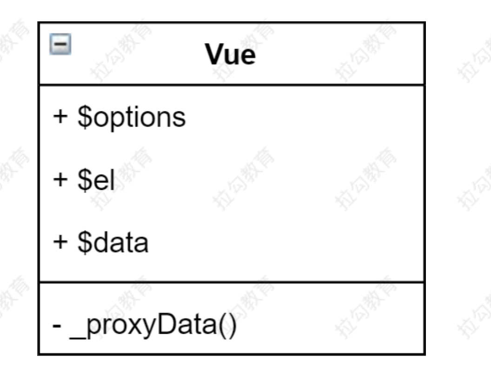
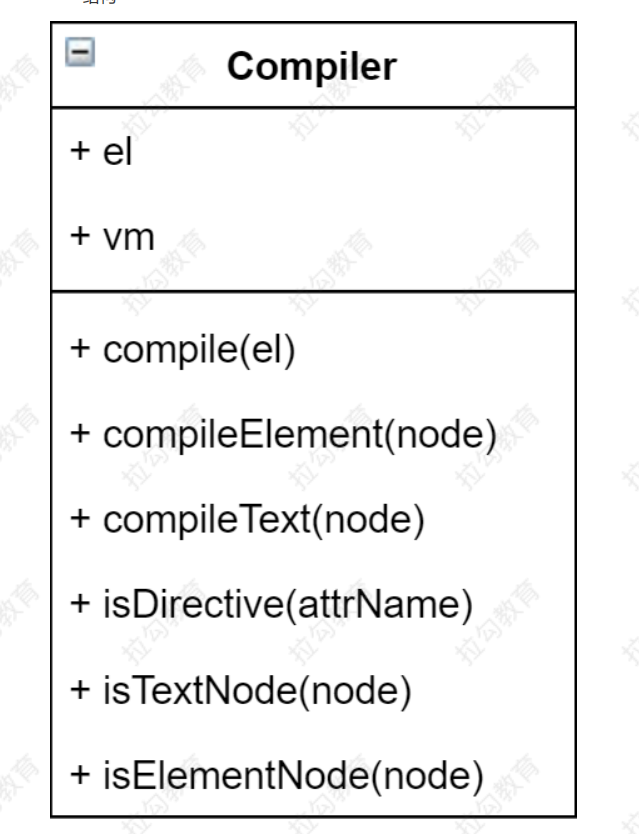

# 1. Vue 响应式原理模拟

## 1.1 准备工作

### 1.1.1 数据驱动
- 数据响应式、双向绑定、数据驱动
- 数据响应式
    - 数据模型仅仅是普通的 js 对象，而当我们修改数据时，试图会进行更新，避免了繁琐的 DOM 操作，提高开发效率
- 双向绑定
    - 数据改变，试图改变；试图改变，数据也改变
    - 我们可以使用 v-model 在表单元素上创建双向数据绑定
    - 包含数据响应式
- 数据驱动是 Vue 最独特的特性之一
    - 开发过程中仅需要关注数据本身，不需要关心数据是如何渲染到试图
    - 因为现在主流的 MVVM 框架内部都已经帮我们数据响应式和双向绑定。


### 1.1.2 响应式的核心原理

Vue 2.x

- [Vue 2.x深入响应式](https://cn.vuejs.org/v2/guide/reactivity.html)
    - 当你把一个普通的 JavaScript 对象传入 Vue 实例作为 data 选项，Vue 将遍历此对象所有的 property，并使用 Object.defineProperty 把这些 property 全部转为 getter/setter。Object.defineProperty 是 ES5 中一个无法 shim 的特性，这也就是 Vue 不支持 IE8 以及更低版本浏览器的原因。
- [MDN - Object.definePrope](https://developer.mozilla.org/zh-CN/docs/Web/JavaScript/Reference/Global_Objects/Object/defineProperty)  
- 浏览器兼容 IE8 以上（不兼容 IE8）

``` js
// 模拟 vue 的 data选项
let data = {
msg: "hello",
};

// 模拟 vue 的实例
let vm = {};

// 数据劫持：当访问或者设置 vm 中的成员的时候，做一些干预操作
// 劫持对象的莫个属性
Object.defineProperty(vm, "msg", {
    enumerable: true, // 可枚举       (可遍历)
    configurable: true, // 可配置       （可以使用 delete 删除，可以通过 defineProperty 重新定义）
    // 获取属性值的时候触发
    get() {
        console.log("get", data.msg);
        return data.msg;
    },
    // 设置属性值的时候触发
    set(newValue) {
        console.log("set", newValue);
        // 数据没有变化就直接返回，不做任何操作
        if (newValue === data.msg) return;

        data.msg = newValue;
        // 数据更改，更新 DOM 的值
        document.querySelector("#app").textContent = data.msg;
    },
});

// 测试
console.log(vm.msg);
setTimeout(() => {
    vm.msg = "Hello World " + Math.random().toFixed(2);
}, 1000);
```

- 如果有一个对象中多个属性需要转换 getter/setter 如何处理？
``` js
// 模拟 vue 的 data选项
let data = {
    msg: "hello",
    count: 1,
};

// 模拟 vue 的实例
let vm = {};

// 劫持对象
proxyData(data);

// 数据劫持：当访问或者设置 vm 中的成员的时候，做一些干预操作
function proxyData(target) {
Object.keys(target).forEach((key) => {
    // 劫持对象的莫个属性
    Object.defineProperty(vm, key, {
    enumerable: true, // 可枚举       (可遍历)
    configurable: true, // 可配置       （可以使用 delete 删除，可以通过 defineProperty 重新定义）
    // 获取属性值的时候触发
    get() {
        console.log("get", data.msg);
        return data.msg;
    },
    // 设置属性值的时候触发
    set(newValue) {
        console.log("set", newValue);
        // 数据没有变化就直接返回，不做任何操作
        if (newValue === data.msg) return;

        data.msg = newValue;
        // 数据更改，更新 DOM 的值
        document.querySelector("#app").textContent = data.msg;
    },
    });
});
}
// 测试
console.log(vm.msg);
setTimeout(() => {
    vm.msg = "msg: Hello World " + Math.random().toFixed(2);
}, 1000);
setTimeout(() => {
    vm.count = "count: " + 200;
}, 2000);
```

Vue 3.x

- [MDN - Pro](https://developer.mozilla.org/zh-CN/docs/Web/JavaScript/Reference/Global_Objects/Proxy)
- 直接监听对象，而非属性。
- ES 6中新增，IE 不支持，性能由浏览器

``` js
// 模拟 vue 的 data选项
let data = {
    msg: "hello",
    count: 1,
};
// 使用proxy实现对数据的劫持
let vm = new Proxy(data, {
    // 访问属性时触发
    get(target, key) {
        console.log("get, key: ", key, target[key]);
        return Reflect.get(target, key);
    },
    // 设置属性时触发
    set(target, key, newValue) {
        console.log("set, key: ", key, target[key]);
        // 值没有变就不往下执行
        if (target[key] === newValue) return;
        Reflect.set(target, key, newValue);
        document.querySelector("#app").textContent = target[key];
    },
});

// 测试
console.log(vm.msg);
setTimeout(() => {
    vm.msg = "msg: Hello World " + Math.random().toFixed(2);
}, 1000);
setTimeout(() => {
    vm.count = "count: " + 200;
}, 2000);
```

总结：
- 代码简洁: proxy 代理了整个对象，也就是这个对象中的所有属性在访问和设置的时候都会触发 get 和 set 方法，如果用 defineProperty的话，我们处理多个属性，我们还需要进行循环，这是 proxy 代码层次的好处
- 性能优化: proxy 性能要比 defineProperty 要好

### 1.1.3 发布订阅模式和观察者模式

#### 1.1.3.1 发布/订阅模式
- 定义者
- 发布者
- 信号中心

> 我们假定，存在一个"信号中心"，某个任务执行完成，就向信号中心"发布"（publish）一个信号，其他任务可以向信号中心"订阅"（subscribe）这个信号，从而知道什么时候自己可以开始执行。这就叫做"发布/订阅模式"（publish-subscribe pattern）

> 父母要孩子的成绩，父母去班级订阅孩子的成绩，一旦考试成绩出来，相当于触发了一个事件，由班级的老师把学成的成绩以短信的方式发送给家长，不需要天天催孩子的成绩出来没。    家长(订阅者) 老师(发布者) 班级(信号中心)

- [Vue 的自定义事件](https://cn.vuejs.org/v2/guide/migration.html#dispatch-%E5%92%8C-broadcast-%E6%9B%BF%E6%8D%A2)

``` js
let vm = new Vue();
// 订阅者
vm.$on("click", () => {
  console.log("click1");
});

vm.$on("click", () => {
  console.log("click2");
});
// 发布者
vm.$emit("click");
```
- 兄弟组件通信过程

``` js
// 1. eventBus.js
// 事件中心
let eventHub = new Vue()

// 2. ComponentA.vue
// 发布者
addTodo: function () {
    // 发布消息(事件)
    eventHub.$emit('add-todo', { text: this.newTodoText })
    this.newTodoText = ''
}
// 3. ComponentB.vue
// 订阅者
created: function () {
    // 订阅消息(事件)
    eventHub.$on('add-todo', this.addTodo)
}
```

- 模拟 Vue 自定义事件的实现
``` js
// 发布订阅模式

// 事件触发器
class EventEmitter {
  constructor() {
    // 存取事件名和事件名对应的事件
    this.subs = Object.create(null);
  }

  // 订阅事件
  $on(eventName, handle) {
     // this.subs[eventName] = [...(this.subs[eventName] || []), handle];
    (this.subs[eventName] || (this.subs[eventName] = [])).push(handle);
  }

  // 触发事件
  $emit(eventName) {
    this.subs[eventName] && this.subs[eventName].forEach((fn) => fn());
  }
}

let event = new EventEmitter();

event.$on("click", () => {
  console.log("click1");
});
event.$on("click", () => {
  console.log("click2");
});

event.$emit("click");
```


#### 1.1.3.2 观察者模式
- 观察者(订阅者) -- Watcher
    - update()：当事件发生时，具体要做的事情   （vue中是更新试图）
- 目标(发布者) -- Dep
    - subs 数组：存储所有的观察者
    - addSub()：添加观察者
    - notify()：当事件发生，调用所有观察者的 update() 方法
- 没有事件中心

``` js
// 观察者模式

// 发布者
class Dep {
  constructor() {
    this.subs = []; // 记录所有的订阅者
  }

  // 添加订阅者
  addSub(sub) {
    // sub是观察者才添加
    sub && sub.update && this.subs.push(sub);
  }
  // 发布通知
  notify() {
    this.subs.forEach((sub) => sub.update());
  }
}

// 订阅者-观察者
class Watcher {
  update() {
    console.log("观察者: " + Math.random().toFixed(2));
  }
}

// 创建发布者
let dep = new Dep();

// 创建观察者
let watcher1 = new Watcher();
let watcher2 = new Watcher();

// 添加观察者
dep.addSub(watcher1);
dep.addSub(watcher2);

// 发布通知
dep.notify();
```

总结： (观察者模式和发布订阅模式)

式的订阅者与发布者之间是存在依赖的。
- 观察者没有事件中心，只有发布者和订阅者，并且发布者需要知道订阅者的存在。
- 观察者模式是由具体目标调度，比如当事件触发，Dep 就会去调用观察者的方法，所以观察者模式的订阅者与发布者之间是存在依赖的。
- 发布/订阅模式由统一调度中心调用，因此发布者和订阅者不需要知道对方的存在。
- 观察者模式订阅者和发布者是相互依赖的，发布订阅模式中多了一个事件中心，事件中心的作用就是隔离发布者和订阅者，去除他们之间的依赖关系，它会变得更灵活


## 1.2 模拟一个最小版本的 Vue   (Vue 响应式原理模拟)
### 1.2.1 Vue 响应式原理模拟的分析
- Vue 基本结构
- 打印Vue实例观察
    - getter 和 setter  成员
        -  需要把 data 中的成员转换成 getter 和 setter 注入到 vue 的实例上，目的是在其他地方使用的使用可以通过 this 来访问 data 中的成员
    - $data 
        - data 中的成员被记录到 $data 中，并且转换为 getter 和 setter
        - $data 中的 getter 和 setter 是真正监听数据变化的地方
        - $开头的成员是公共成员
    - $options
        - 把 Vue 的构造函数的参数记录到 $options 中
    - _data 
        - _data 和 $data 指向的是同一个对象，它是私有成员
    - $el
        - 是选中的el
        - 它可以是选择器，也可以是一个 dom 对象
        - 如果是选择器，需要把选择器，转换成 dom 对象
- 整体架构


- Vue
    - 把 data 中的成员注入到 Vue 实例，并且把 data 中的成员转成 getter/setter
- Observer
    - 能够对数据对象的所有属性进行监听，如有变动可拿到最新值并通Dep
- Compiler
    - 解析每个元素中的指令/插值表达式，并替换成相应的数据
- Dep
    - 添加观察者(watcher)，当数据变化通知所有观察者
- Watcher
    - 数据变化更新视图


### 1.2.2 Vue 的实现
- 功能
    - 负责接收初始化的参数(选项)
    - 负责把 data 中的属性注入到 Vue 实例，转换成 getter/setter
    - 负责调用 observer 监听 data 中所有属性的变化
    - 负责调用 compiler 解析指令/插值表达式

- 结构
    - Vue 类
    - $options  属性
    - $el   属性
    - $data 属性
    - _proxyData 方法



- 根据上面的分析实现代码如下：

``` js
// vue 的实现

// - 功能
//     - 通过属性保存初始化的参数(选项)
//     - 把 data 中的属性注入到 Vue 实例，转换成 getter/setter
//     - 调用 observer 监听 data 中所有属性的变化
//     - 调用 compiler 解析指令/插值表达式

// - 结构
//     - Vue 类
//     - $options  属性
//     - $el   属性
//     - $data 属性
//     - _proxyData 方法

// Vue 类
class Vue {
    constructor(options) {
        // 1. 通过属性保存初始化的参数(选项)
        // 保存options选项
        this.$options = options || {};
        // 保存el元素
        const el = options.el;
        this.$el = typeof el === "string" ? document.querySelector(el) : el;
        // 保存options的data对象
        this.$data = options.data || {};


        // 2. 把 data 中的属性注入到 Vue 实例，转换成 getter/setter
        this._proxyData(this.$data);

        // 3. 调用 observer 监听 data 中所有属性的变化

        // 4. 调用 compiler 解析指令/插值表达式

    }
    // 代理数据
    _proxyData(data) {
        // 遍历data的所有属性
        Reflect.ownKeys(data).forEach(prop => {
            // 将 data 中的属性注入到 Vue 实例上，并转换成 getter/setter
            Reflect.defineProperty(this, prop, {
                get() {
                    return data[prop];
                },
                set(newValue) {
                    if (newValue === data[prop]) return;
                    data[prop] = newValue;
                }
            })
        })
    }
}
```

### 1.2.3 Observer 的实现
- 功能
    - 负责把 data 选项中的属性转换成响应式数据  (getter/setter)
    - data 中的某个属性也是对象，把该属性转换成响应式数据
    - 数据变化发送通知
- 结构
    - Observer 类
    - walk(data)                 观察对象
    - defineReactive(data,prop,value)    定义响应式成员


- 根据上面的分析实现代码如下： 

``` js
// Observer 的实现
// observer 监听 data 中所有属性的变化

// - 功能
//     - 负责把 data 选项中的属性转换成响应式数据   (getter/setter)
//     - data 中的某个属性也是对象，把该属性转换成响应式数据
//     - 数据变化发送通知       结合Dep观察者实现

// - 结构
//     - Observer 类
//     - walk(data)                 观察对象
//     - defineReactive(data,prop,value)    定义响应式成员

class Observer {
    constructor(data) {
        this.walk(data);
    }

    // 1. 负责把 data 选项中的属性转换成响应式数据
    walk(data) {
        // 不是对象直接返回
        if (!data || typeof data !== "object") return;

        // 遍历 data 的所有成员
        Reflect.ownKeys(data).forEach(prop => {
            // 定义响应式成员
            this.defineReactive(data, prop, data[prop]);
        })
    }

    // 定义响应式成员
    defineReactive(data, prop, value) {
        const self = this;
         // 2. data 中的属性也是对象，把该对象也转换成响应式数据
        self.walk(value);
        Reflect.defineProperty(data, prop, {
            enumerable: true,   // 可枚举
            configurable: true, // 可配置   (能delete 和 重新 defineProperty)
            // 访问成员时触发
            get() {
                return value;
            },
            // 设置成员时触发
            set(newValue) {
                if (newValue === value) return; // 值没有变化不做任何逻辑
                // 新赋值的newValue是对象，把该对象也转换成响应式数据
                self.walk(newValue);
                value = newValue;

                // 3. 发送通知   Dep
            }
        })
    }
}
```
- Observer-defineReactive 的问题
``` js
// 1.为什么 get 方法不能返回 data[prop]
// 因为返回data[prop]相当于一直访问这个属性的get方法，这样就造成了死循环
defineReactive(data, prop, value) {
    const self = this;
    self.walk(value);
    Reflect.defineProperty(data, prop, {
        enumerable: true,  
        configurable: true, 
        get() {
            // 这里不能return data[prop]，不然会死循环
            return value;
        },
        set(newValue) {
            if (newValue === value) return; 
            self.walk(newValue);
            value = newValue;
        }
    })
}
// 2. defineReactive为什么要传递第三个参数value
// 因为使用data[prop]会造成死循环，所以才使用第三个参数，把值属性值传递过来
// 外部对defineReactive的get方法有引用，而get中有用到了value，所以此次发生了闭包，扩展了value的作用域。

// 3. 注意的是defineReactive中的this指向的是data对象，并不是指向Observer对象
```


### 1.2.4 Compiler  的实现

- 功能
    - 负责编译模板，解析指令/插值表达式
    - 负责页面的首次渲染
    - 当数据变化后重新渲染视图
- 结构
    - Compiler 类
    - el 
    - vm
    - compile(el)               编译
    - compileElement(node)      编译元素节点
        - 负责编译元素的指令
        - 处理 v-text 的首次渲染
        - 处理 v-model 的首次渲染
    - compileText(node)         编译本本节点
        - 负责编译插值表达式
    - isDirective(attrName)     是否是v-指令
    - isTextNode(node)          是否是本文节点
    - isElementNode(node)       是否是元素节点



- 根据上面的分析实现代码如下： 

``` js
// compiler 的实现      操作dom

// - 功能
//      - 编译模板，解析指令/插值表达式
//      - 页面的首次渲染
//      - 当数据变化后重新渲染视图
// - 结构
//      - Compiler 类
//      - el 
//      - vm
//      - compile(el)               编译
//          - 负责编译插值表达式
//      - compileElement(node)      编译元素节点
//          - 负责编译元素的指令
//          - 处理 v-text 的首次渲染
//          - 处理 v-model 的首次渲染
//      - compileText(node)         编译本本节点
//      - isDirective(attrName)     是否是v-指令
//      - isTextNode(node)          是否是本文节点
//      - isElementNode(node)       是否是元素节点

class Compiler {
    constructor(vm) {
        this.vm = vm;               // 保存vue实例
        this.el = vm.$el;           // 保存el元素
        this.compile(this.el);
    }
    // 1. 编译模板，解析指令/插值表达式
    // 编译模板 处理文本节点和元素节点
    compile(el) {
        const nodes = el.childNodes;    // 获取子节点对象
        // 遍历el的所有子节点   Array.from 将类数组转换成数组
        Array.from(nodes).forEach(node => {
            // 处理文本节点
            if (this.isTextNode(node)) {
                this.compileText(node);
            } else if (this.isElementNode(node)) {
                // 处理元素节点 
                this.compileElement(node);
            }
            // 如果当前节点中还有子节点，递归编译
            if (node.childNodes && node.childNodes.length) this.compile(node);
        })
    }
    // 1.1 编译文本节点 处理插值表达式
    compileText(node) {
        // console.dir(node);      //  console.dir将输出的变量以对象的形式打印出来  #text对象
        // 1.) 使用正则表达式实现下面的功能
        // 1. 匹配插值表达式    {{ msg }}        插值表达式
        // 2. 将插值表达式中的内容提取出来       也就是 msg
        let reg = /\{\{(.+?)\}\}/;

        // 2.) 获取文本节点的插值表达式并替换成对应的值
        // 1. 获取文本节点的内容
        let value = node.textContent;
        // 2. 将插值表达式替换成对应的值
        if (reg.test(value)) {
            //  插值表达式中的值就是我们要的属性名称
            let prop = RegExp.$1.trim();   // 获取第一个分组()的内容
            // 把插值表达式替换成具体的值   首次渲染插值表达式中的值 
            node.textContent = value.replace(reg, this.vm[prop]);
        }
    }
    // 1.2 编译元素节点 处理指令
    compileElement(node) {
        console.log(node.attributes);
        // 获取所有属性节点
        let attrs = node.attributes
        // 遍历所有的属性节点
        Array.from(attrs).forEach(attr => {
            let attrName = attr.name;   // 获取属性名
            // 判断是否是指令
            if (this.isDirective(attrName)) {
                // 处理指令
                // v-text --> text
                attrName = attrName.slice(2);   // 获取指令的名称
                let prop = attr.value;   // 获取指令的值 (vm中的属性名)

                // 使用update这种方式比if的好处  (策略模式)
                // 就是以后要加其他的指令，不需要改动原有代码的逻辑，只需要添加新的方法就行了。
                this.update(node, attrName, prop);
            }
        });
    }
    /**
     * 1.2.1 负责编译元素的指令
     * @param {*} node 节点对象
     * @param {*} attrName 指令的名称
     * @param {*} prop 指令对应的属性名
     */
    update(node, attrName, prop) {
        let updateFn = this[attrName + "Update"]; // 获取编译指令的方法
        updateFn && updateFn.call(this, node, this.vm[prop]);
    }
    // 1.2.2  处理 v-text 的首次渲染            
    textUpdate(node, value) {
        // 首次渲染v-text中的值
        node.textContent = value;  
    }
    // 1.2.3 处理 v-model 的首次渲染   (用在表单元素上的)
    modelUpdate(node, value) {
        // 首次渲染v-model中的值
        node.value = value;
    }

    // 判断是否是以 v- 开头的指令
    isDirective(attrName) {
        return attrName.startsWith("v-");
    }
    // 判断是否是文本节点
    isTextNode(node) {
        return node.nodeType === 3;
    }
    // 判断是否是属性节点
    isElementNode(node) {
        return node.nodeType === 1;
    }
}
```

### 1.2.5 Dep(Dependency)   的实现  收集依赖


- 功能
    - 收集依赖，添加观察者(watcher)
        - 在data的getter方法中收集依赖(添加观察者)  addSub(watcher)
        - 在data的setter方法中通知依赖(通知观察者/发送信息)    notify()
    - 通知所有观察者
- 结构
    - subs                 观察者数组
    - addSub(sub)          收集依赖(添加观察者) 
    - notice               发送消息(通知观察者)


- 根据上面的分析实现代码如下：
``` js

// Dep 的实现

// - 功能
// - 收集依赖，添加观察者(watcher)
//     - 在data的getter方法中收集依赖(添加观察者)  addSub(watcher)
//     - 在data的setter方法中通知依赖(通知观察者/发送信息)    notice()
// - 通知所有观察者

// - 结构
// - subs                 观察者数组
// - addSub(sub)          收集依赖(添加观察者) 
// - notice               发送消息(通知观察者)

class Dep {
    constructor() {
        this.subs = []; // 收集依赖  记录观察者的数组
    }
    // 添加观察者
    addSub(sub) {
        // 是观察者才添加进去
        sub && sub.update && this.subs.push(sub);
    }
    // 向观察者发送消息
    notify() {
        this.subs.forEach(sub => { sub.update() });
    }
}

// 在 Observer.js 的 defineReactive 中
// Dep 添加依赖，并发送消息
defineReactive(data, prop, value) {
    const self = this;
    // 3. 创建Dep 对象，负责收集依赖，并发送通知
    let dep = new Dep();
    self.walk(value);
    Reflect.defineProperty(data, prop, {
        enumerable: true,   
        configurable: true,
        get() {
            // 3.1 添加依赖
            Dep.target && dep.addSub(Dep.target);
            return value;
        },
        set(newValue) {
            if (newValue === value) return;
            self.walk(newValue);
            value = newValue;
            // 3.2 发送通知   Dep
            dep.notify();
        }
    })
}
```

### 1.2.6 Watcher   的实现


- 功能
    - 当数据变化触发依赖， dep 通知所有的 Watcher 实例更新视图
    - 自身实例化的时候往 dep 对象中添加自己
- 结构
    - vm                  vm实例
    - key                 data中的属性名
    - cb                  回调函数，如何更新视图，通过vm和key拿到数据，并更新视图
    - oldValue            变化之前的值
    - update()            更新的方法
        - 拿到oldValue和vm[key]去做比较，如果数据发生了变化就通过cb去更新视图，没有发生变化就不做任何操作


- 代码实现如下：
``` js
// watcher 的实现

// - 功能
//     - 当数据变化触发依赖， dep 通知所有的 Watcher 实例更新视图
//     - 自身实例化的时候往 dep 对象中添加自己
// - 结构
//     - vm                  vm实例
//     - key                 data中的属性名
//     - cb                  回调函数，如何更新视图，通过vm和key拿到数据，并更新视图
//     - oldValue            变化之前的值
//     - update()            更新的方法
//          - 拿到oldValue和vm[key]去做比较，如果数据发生了变化就通过cb去更新视图，没有发生变化就不做任何操作

class Watcher {
    constructor(vm, key, cb) {
        this.vm = vm;           // vue 实例
        this.key = key;         // data中的属性名
        this.cb = cb;           // 回调函数，负责更新视图


        // 2. 自身实例化的时候往 dep 对象中添加自己
        // 2.1 把watcher对象记录到Dep类的静态属性target
        Dep.target = this;
        // 2.2 触发$data的get方法，在get方法中会调用addSub方法添加watcher
        this.oldValue = vm[prop];    // 变化之前的值
        // 2.3 防止watcher重复添加
        Dep.target = null;
    }
    // 数据发生变化更新视图
    update() {
        let newValue = this.vm[this.key];       // 拿到最新的值
        if (this.oldValue === newValue) return;  // 旧值和新值一样就不做任何操作
        this.cb(newValue);      // 将最新的值交给cb函数去更新视图
    }
}
```

- 在什么地方添加watcher对象  (操作dom的时候添加watcher对象)
``` js
// 1. 在 compiler.js 中 处理 插值表达式中添加
// 1.1 处理插值表达式的时候创建
compileText(node) {
    let reg = /\{\{(.+?)\}\}/;
    let value = node.textContent;
    if (reg.test(value)) {
        let prop = RegExp.$1.trim();  
        // 把插值表达式替换成具体的值   首次渲染插值表达式中的值
        node.textContent = value.replace(reg, this.vm[prop]);
        // 当数据变化后重新渲染视图
        // 创建watcher对象来处理文本节点的插值表达式
        let watcher = new Watcher(this.vm, prop, (newValue) => {
            node.textContent = newValue;
        });
    }
}
// 2. 在 comiler.js 中 处理 指令的时候添加
// 2.1 处理v-text指令的时候创建
textUpdate(node, value, prop) {
    // 首次渲染v-text中的值
    node.textContent = value;
    // 3. 当数据变化后重新渲染视图
    // 3.2) 处理v-text指令的时候创建watcher对象
    let watcher = new Watcher(this.vm, prop, (newValue) => {
        node.textContent = newValue;
    });
}
// 2.2 处理v-model指令的时候创建
modelUpdate(node, value, prop) {
    // 首次渲染v-model中的值
    node.value = value;
    // 3. 当数据变化后重新渲染视图
    // 3.3) 处理v-model的时候创建watcher对象
    let watcher = new Watcher(this.vm, prop, (newValue) => {
        node.value = newValue;
    });
}
```

### 1.2.7  双向绑定  的实现
- 数据发生变化更新试图
    - 通过上面的响应式机制已经实现了        (observer+dep+watcher)
    - 在getter方法中添加观察者对象
    - 在setter方法中通知观察者更新视图
- 试图发生变化更新数据
    - 在表单元素的值发生变化时会触发input事件
    - 在input事件发生的时候我们需要把文本框中的值取出来重新赋值

- 代码实现如下
``` js
 // 1.2.3 处理 v-model 指令       (用在表单元素上的)
modelUpdate(node, value, prop) {
    // 首次渲染v-model中的值
    node.value = value;
    // 3. 当数据变化后重新渲染视图
    // 3.3) 处理v-model的时候创建watcher对象
    let watcher = new Watcher(this.vm, prop, (newValue) => {
        node.value = newValue;
    });
    // 实现双向绑定
    node.addEventListener("input", () => {
        // 会触发响应式机制，当数据发生变化的时候，又会重新更新我们的试图，所以试图变化插值表达式的值也会发生变化
        this.vm[prop] = node.value; 
    })
}
```

### 1.2.8  调试

通过调试加深对代码的理解
1. 调试页面首次渲染的过程
    -  在 new Vue 的时候打个断点
    -  在 Vue 的 _proxyData 方法中把 $data 中的属性注入到 vue 实例中
    -  在 new Observer 中把 $data 中的数据转换成 getter 和 setter方法 （并且监听数据的变化，数据响应式机制）
        - 构造函数中调用 walk 方法
        - 在 walk 方法中调用 defineReactive 方法把 $data 对象的所有成员转换成 getter 和 setter
        - 在 defineReactive 中为每一个属性创建 dep 对象，dep的作用是收集依赖(getter方法中)，并发布通知(setter方法中)。
        - 此处getter方法和setter方法只是定义，并不会执行。
    -  在 new Compiler 中解析指令和插值表达式
        - 构造函数中调用 compile方法编译模板，处理文本节点和元素节点
        - 在 compile 方法遍历$el元素的所有子节点，找到每个节点，判断是文本节点还是元素节点，做不同的处理
        - 在处理文本节点的方法中，判断文本值是否有{{}}插值表达式，有就处理插值表达式，并首次渲染插值表达式，没有就不做任何逻辑
        - 有插值表达式才会执行下面的逻辑
            - 使用正则表达式获取插值表达式中的变量，并通过this.vm[key]获取属性对应值的时候，会触发vue的getter方法，在getter方法中调用data[key]会触发Observer中的getter方法，在Observer的getter方法中会判断Dep.target是否有值，如果有值会添加依赖(watcher对象)，此时target没有值，这里会把data[key]值返回替换掉插值表达式中的变量名。
            - 第一次渲染插值表达式完成
            - 紧接着会创建watcher对象，创建watcher对象的目的是，当数据发生变化的时候，再去更新我们的试图。 
            - 在watcher对象中有个cb回掉函数，回掉函数接受新的值，并更新试图。会在update函数中执行
            - 在创建watcher对象的时候是如何把watcher对象添加到dep里面的
                - 会执行Dep.target = this，target指向的就是我们创建的watcher对象，
                - 然后执行this.oldValue = vm[key]，会触发vue的getter方法，在getter方法中调用data[key]会触发Observer中的getter方法，在Observer的getter方法中会判断Dep.target是否有值，如果有值会添加依赖(watcher对象)，此时target有值，会把watcher对象添加到dep的subs数组中去， 返回data[key]的值
                - 执行Dep.target = null, 防止watcher对象重复添加
        - 在处理元素节点的方法中，判断属性节点是否有v-指令开头的属性，有就处理指令，并首次渲染指令，没有就不做任何逻辑
        - 有v-开头的指令才会执行下面的逻辑
            - 获取v-开头属性节点中的变量，并通过this.vm[key]获取属性对应值的时候，会触发vue的getter方法，在getter方法中调用data[key]会触发Observer中的getter方法，在Observer的getter方法中会判断Dep.target是否有值，如果有值会添加依赖(watcher对象)，此时target没有值，这里会把data[key]值返回替换掉插值表达式中的变量名。
            - 第一次渲染插值表达式完成
            - 紧接着会创建watcher对象，创建watcher对象的目的是，当数据发生变化的时候，再去更新我们的试图。 
            - 在watcher对象中有个cb回掉函数，回掉函数接受新的值，并更新试图。会在update函数中执行
            - 在创建watcher对象的时候是如何把watcher对象添加到dep里面的
                - 会执行Dep.target = this，target指向的就是我们创建的watcher对象，
                - 然后执行this.oldValue = vm[key]，会触发vue的getter方法，在getter方法中调用data[key]会触发Observer中的getter方法，在Observer的getter方法中会判断Dep.target是否有值，如果有值会添加依赖(watcher对象)，此时target有值，会把watcher对象添加到dep的subs数组中去， 返回data[key]的值
                - 执行Dep.target = null, 防止watcher对象重复添加
        - 判断子节点是否还有子节点，如果还有就递归调用 compile 方法编译模板

    - 总结： 在页面首次渲染的时候会调用 compiler 对象的处理插值表达式和指令的相关方法，把我们的数据更新到 dom 元素上面来，当更新完试图之后同时还会创建 watcher 对象，在watcher对象里面收集依赖，当数据变化的时候，会调用watcher的回掉函数cb。这个回掉函数是在后面数据改变的时候更新试图的过程中调用。
2. 调试数据改变更新视图的过程 (响应式数据执行的过程)
    - 当数据改变发送通知的时候设置断点 (在 Observer 的 set 方法中设置断点)
    - 调用 dep.notify 方法，在 dep.notify 方法中遍历所有的 watcher，调用 watcher 的 update 方法，
    - 在 update 方法中取到 key(属性) 对应的值，判断新，旧两个值是否相等，如果值想等就不做任何逻辑，值不想等就执行 watcher 的 cb 回掉函数，在 cb 的回掉函数中更新试图，操作 dom。 cb 回掉函数在 compiler 方法中处理 dom 节点的时候已经创建了。在 dom 中视图所有需要依赖我们数据的地方都需要创建 watcher 对象，当数据发生变化的时候，会触发 watcher 的 cb 回掉函数，在回掉函数中更新试图。    (数据变化视图更新)

### 1.2.9 总结
- 问题
    - 给属性重新赋值成对象，是否是响应式的？
        - 是响应式的数据
        - 这个属性必须是之前在 data 中存在过的属性
        - 因为这个属性在 data 中定义过，所以这个属性是响应式数据
        - 当我们重新给他赋值的时候，会触发 Observer 的 setter 方法，在 setter 方法中首先会把新的值记录下来，然后调用 this.walk 方法，在 walk 方法中遍历对象的所有属性，重新把他定义成响应式数据。
    - 给 Vue 实例新增一个成员是否是响应式的？
        - 不是响应式的数据
        - vue 的 data 数据是在 new Vue 的时候调用 new Observer 方法 把 data 的数据变成响应式数据的。
        - 当我们 new Vue 之后添加的属性，此时仅仅只是给 vm 上增加了一个普通的 js 属性，此时的属性不是响应式的。
- vue 官方文档对响应式数据的说明
    - 对于已经创建的实例，Vue 不允许动态添加根级别的响应式属性，但是，可以使用 Vue.set(object, propertyName, value) 方法向嵌套对象添加响应式属性。你还可以使用 vm.$set 实例方法，这也是全局 Vue.set 方法的别名例如：
``` js
    // Vue.set 里面调用了 defineReactive 帮我们把这个属性转换成 getter 和 setter 
    Vue.set(vm.someObject,"b",2);
    Vue.$set(vm.someObject,"b",2);
```
  
- 通过下图回顾整体流程
    - new Vue() 接受 options 的属性 
        - this.$options
        - this.$el
        - this.$data
    - 调用 _proxyData 方法把 options的data 注入到 vue 实例中
    - 创建 Observer , 在 Observer 中调用 walk 方法把 $data 中的属性转换成 getter 和 setter 方法
    - 在数据变化的时候，调用 setter 方法通知变化，告诉 dep 数据变化了，dep 调用 notify 方法发送通知，通知 watcher，watcher 的 update 方法中更新视图。  (数据变化更新视图)
    - 当我们创建 watcher 对象的时候，会把当前 watcher 对象添加到 dep 的 subs 数组中，收集依赖。
    - 创建 Compiler ，解析指令，解析插值表达式
    - 在页面首次加载的时候会调用，Compiler 里面的相关方法更新视图，同时创建 watcher 对象用来 订阅数据变化，绑定更新函数(cb回调函数)，当数据发生变化的时候会通知 watcher，调用 cb 回调函数更新视图 
    - 当页面首次加载的时候是通过 compiler 来更新视图，当数据变化的时候是通过 watcher 的 update 更新视图。
    - 以上就是整体流程。


### 1.2.10 参考文档
- [深入响应式原理](https://cn.vuejs.org/v2/guide/reactivity.html)
- [https://github.com/DMQ/mvvm](https://github.com/DMQ/mvvm)


## 1.3 响应式原理在面试的常见问题
## 1.4 学习别人优秀的经验，转换成自己的经验
## 1.5 实际项目中出问题的原理层面的解决
- 给 Vue 实例新增一个成员是否是响应式的？
- 给属性重新赋值成对象，是否是响应式的？
## 1.6 为学习 Vue 源码做铺垫